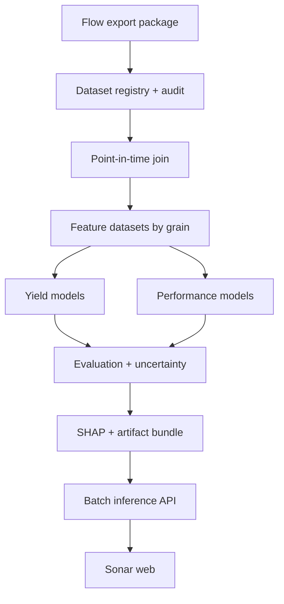

# Sonar: Flow 다중 파일 기반 수율·성능 추론 및 SHAP 구현 계획

> 상태: Proposed  
> 기준일: 2026-08-13  
> 기준 코드: `goood2280/Sonar`의 `agent/add-sonar-web-app` 브랜치와 `goood2280/flow` `main`  
> 목표: Flow가 전처리한 여러 데이터 파일을 Sonar가 독립적으로 등록·검증·결합하고, 수율 및 성능을 재현 가능하게 추론하며, 통과한 모델에 한해 SHAP 설명을 제공한다.

## 1. 결론 및 권장 방향

Sonar는 다음 구조로 가는 것이 가장 안전하고 구현 가능성이 높다.

1. **Flow와 Sonar를 서비스 호출로 강결합하지 않는다.** Flow는 versioned export package와 manifest를 만들고, Sonar는 이를 자체 주기로 읽는다.
2. **파일을 이름이나 열 유사성만으로 합치지 않는다.** 각 파일의 역할, grain, key, event time, `available_at`, schema, hash를 manifest에 선언한다.
3. **수율과 성능은 처음부터 별도 target/head로 학습한다.** 둘을 하나의 임의 가중 점수로 합치지 않고, 마지막 단계에서 예측값과 불확실성으로 Pareto 분석을 수행한다.
4. **첫 production candidate는 LightGBM 기반의 CPU tree stack으로 한다.** 선형·historical baseline을 반드시 함께 두고, CatBoost는 고카디널리티 범주형 challenger로 비교한다.
5. **SHAP는 tree model gate를 통과한 후 적용한다.** 원본 수천 개 좌표 열이 아니라 해석 가능한 aggregate/spatial descriptor를 설명하고, `source → process area/structure → feature` 계층으로 합산한다.
6. **학습과 추론은 Python runtime이 담당하고 현재 Sonar 웹은 제어·조회 UI로 유지한다.** 브라우저나 Next API route에서 대용량 Parquet 학습을 수행하지 않는다.
7. **초기 운영 방식은 batch inference와 shadow mode로 제한한다.** 자동 공정 변경, 자동 split 추천 반영, SHAP의 인과 해석은 범위에서 제외한다.

SHAP 적용 자체는 충분히 가능하다. 다만 현재 Flow의 `backend/routers/ml.py`는 모델 이름과 무관하게 상관계수 기반 선형 조합을 반환하는 데모이므로, 이를 Sonar의 실제 학습 엔진으로 재사용해서는 안 된다.

## 2. 현재 상태와 확인된 개선 필요점

### 2.1 Sonar 저장소

- `main`에는 `README.md`와 `setup.py`만 있으며, README가 가리키는 `PLAN.md`, `docs/*`, `src/sonar/*`는 커밋되어 있지 않다.
- `setup.py`는 `src/sonar` package와 `sonar.cli:main`을 전제로 하지만 실제 package source가 없어 현재 상태로는 CLI를 제공할 수 없다.
- 실제 최신 웹 앱은 Draft PR #1의 `agent/add-sonar-web-app` 브랜치에 있다.
- 웹의 Map lab과 Surrogate lab은 현재 합성 데이터와 하드코딩 수식 기반이다. 실제 모델 결과와 명확히 분리되어야 한다.
- Data intake는 source metadata를 저장하지만 manifest schema 검증, Parquet schema audit, key uniqueness, join coverage, leakage audit를 실행하지 않는다.
- local sidecar는 파일 탐색·복사까지만 담당하며 모델 job, artifact registry, batch inference 기능은 없다.
- 현재 sidecar CORS가 `*`이므로 실제 데이터 연결 단계에서는 명시적 localhost origin allowlist로 좁혀야 한다.

### 2.2 Flow 저장소

Flow에는 Sonar 입력으로 활용할 수 있는 구조가 이미 상당 부분 존재한다.

- wafer-wide baseline: `ML_TABLE_<PRODUCT>.parquet`
- legacy aggregate: `features_et_wafer.parquet`, `features_inline_agg.parquet`
- long-form source: FAB, INLINE, ET, VM, YLD
- 공정·공간 mapping: `matching_step.csv`, `knob_pppid.csv`, `mask.csv`, `inline_step_match.csv`, `inline_item_map.csv`, `inline_subitem_pos.csv`, `yld_shot_agg.csv`
- 공통 key 후보: `product`, `root_lot_id`, `lot_id`, `wafer_id`, shot/chip/TEG 좌표
- 물리 순서 개념: L0 FAB/VM/MASK/KNOB → L1 INLINE → L2 ET → L3 YLD

하지만 Flow의 현 ML endpoint에는 production model에 필요한 다음 요소가 없다.

- `model` 요청값과 무관하게 동일한 상관계수 기반 계산 수행
- row 순서에 의존하는 단순 last-N split이며 명시적 시간 정렬과 lot grouping이 없음
- 결측을 일괄 0으로 대체하고 missingness 의미를 보존하지 않음
- 임의 class encoding과 threshold 사용
- preprocessing을 fold 내부에서 fit하지 않음
- model/pipeline/data lineage 저장 없음
- uncertainty, calibration, drift, SHAP 없음
- `predict`가 entity별 예측 레코드와 model version을 반환하지 않음
- Pareto 추천이 단위 정규화 없이 고정 가중치에 의존함

따라서 Flow ML 코드는 참고용 UI/prototype으로만 두고, Sonar에 독립된 Python training runtime을 구현한다.

## 3. 목표 범위와 비범위

### 포함

- Flow 다중 파일 export manifest v1
- 로컬 폴더·S3 prefix ingestion
- schema/key/grain/time/lineage audit
- point-in-time safe join
- wafer/shot/chip grain별 feature build
- 수율 회귀·저수율 분류·chip pass/fail 중 data가 허용하는 task
- DVC/성능 지표별 회귀 및 spec miss 분류
- chronological + group-safe evaluation
- quantile prediction 또는 calibration 기반 uncertainty
- global/local/grouped SHAP
- model/data/artifact versioning
- batch inference API와 Sonar web 연동
- drift 및 label-arrival monitoring

### 초기 범위에서 제외

- SHAP를 인과 효과로 해석하는 기능
- synthetic counterfactual을 실제 공정 recipe 추천으로 자동 반영
- request 시점의 즉석 재학습
- raw chip/shot 전체를 D1/R2 소형 workspace에 저장
- 처음부터 neural MoE, GNN, end-to-end spatial transformer 적용
- wafer label을 chip row에 복제하는 가짜 grain 변환
- 서로 다른 성능 단위와 수율을 임의 가중합한 단일 target

## 4. 목표 아키텍처



### Runtime 분리

| 영역 | 책임 | 권장 runtime |
|---|---|---|
| Flow | 원천 정규화, long/wide 산출, geometry/rulebook export | 기존 FastAPI/worker |
| Sonar model runtime | audit, join, feature build, train, evaluate, SHAP, batch predict | Python 3.10+ / Polars / PyArrow / scikit-learn / LightGBM |
| Sonar web | dataset/run 상태, 예측·SHAP·map·Pareto 시각화, 승인 흐름 | 현재 Next/Vinext app |
| Artifact store | manifest, model, metrics, prediction, SHAP 결과 | local/S3; metadata는 SQLite 또는 MLflow optional |

로컬 alpha에서는 Python API를 `127.0.0.1`에만 bind하고, `npm run local`이 FILES + MODEL + WEB 세 프로세스를 함께 띄운다. 서버 배포에서는 training worker와 read-only inference API를 분리한다.

## 5. Flow export package 계약

### 5.1 권장 디렉터리

```text
flow-exports/
└── <product>/
    └── <dataset_version>/
        ├── manifest.json
        ├── tables/
        │   ├── wafer_base.parquet
        │   ├── fab_events/*.parquet
        │   ├── inline_points/*.parquet
        │   ├── et_points/*.parquet
        │   ├── vm_points/*.parquet
        │   ├── chip_yield_labels/*.parquet
        │   └── performance_labels/*.parquet
        ├── geometry/
        │   ├── shot_geometry.parquet
        │   ├── chip_geometry.parquet
        │   └── teg_geometry.parquet
        └── dictionaries/
            ├── feature_catalog.parquet
            ├── target_catalog.parquet
            └── rulebooks/*.csv
```

모든 파일이 항상 필요한 것은 아니다. `manifest.json`이 실제로 존재하는 role만 선언하며, `wafer_base`는 빠른 baseline용 optional 입력이다.

### 5.2 file role

| role | 기본 grain | 필수 key | 용도 |
|---|---|---|---|
| `wafer_base` | wafer | product, root_lot_id, wafer_id | 기존 ML_TABLE 기반 baseline |
| `fab_events` | wafer × step execution | wafer key + step_id + event_time | 공정 이력·recipe·equipment feature |
| `inline_points` | wafer × item × position | wafer key + item_id + position | L1 aggregate/spatial feature |
| `et_points` | wafer × item × shot/TEG | wafer key + item_id + shot/TEG | L2 performance 또는 yield upstream feature |
| `vm_points` | wafer × step × sensor/run | wafer key + step/sensor | L0 feature |
| `chip_yield_labels` | wafer × chip | wafer key + chip_x/chip_y | chip pass/fail, bin, wafer yield 산출 |
| `performance_labels` | wafer/shot/chip × metric × condition | entity key + metric_id + condition_id | DVC/성능 target |
| `geometry` | coordinate entity | geometry_id + 좌표 | map descriptor와 join |
| `feature_catalog` | feature definition | feature_id | unit, source, group, clock, 방향성 |
| `target_catalog` | target definition | target_id | 단위, spec, higher_is_better, available_at rule |

### 5.3 manifest 필수 필드

```json
{
  "contractVersion": "flow-sonar-export/v1",
  "datasetVersion": "PRODA-2026-08-13T090000Z",
  "product": "PRODA",
  "createdAt": "2026-08-13T09:00:00Z",
  "producer": {
    "name": "flow",
    "version": "10.4.89",
    "gitSha": "<sha>"
  },
  "predictionClocks": ["pre_inline", "post_inline", "post_et"],
  "files": [
    {
      "role": "wafer_base",
      "uris": ["s3://.../wafer_base.parquet"],
      "format": "parquet",
      "grain": "wafer",
      "primaryKeys": ["product", "root_lot_id", "wafer_id"],
      "eventTime": "wafer_started_at",
      "availableAt": "features_available_at",
      "schemaVersion": "wafer-base/v1",
      "schemaFingerprint": "sha256:...",
      "contentHashes": ["sha256:..."],
      "rowCount": 100000,
      "minEventTime": "2026-01-01T00:00:00Z",
      "maxEventTime": "2026-08-12T23:59:59Z",
      "partitionKeys": ["product", "event_date"]
    }
  ]
}
```

### 5.4 계약 규칙

- timestamp는 UTC ISO-8601 또는 Arrow timestamp로 통일하고 timezone을 명시한다.
- `available_at`은 해당 값이 실제 추론 시점에 사용할 수 있었던 최초 시각이다. 파일 생성 시각으로 대체하지 않는다.
- 모든 수치 feature와 target은 unit 및 scale을 catalog에 기록한다.
- key string은 trim 후 canonical case를 적용하되 원본값도 lineage에 보존한다.
- declared primary key 중복은 원칙적으로 0건이어야 한다. 반복 측정이면 `repeat_id`/`measure_time`을 key에 추가한다.
- file content hash와 schema fingerprint가 바뀌면 같은 `datasetVersion`을 재사용하지 않는다.
- wildcard를 쓸 경우 실제 object 목록과 각 hash를 audit artifact로 고정한다.
- Sonar는 basename 추정 대신 `role`을 기준으로 파일을 resolve한다.

## 6. Prediction clock과 누수 방지

같은 target이라도 예측 시점이 다르면 별도 task/version이다.

| clock | 허용 feature | 대표 target |
|---|---|---|
| `pre_inline` | KNOB, MASK, FAB, available VM | 후속 INLINE, ET/DVC, yield |
| `post_inline` | 위 + 해당 시점까지의 INLINE | ET/DVC, yield |
| `post_et` | 위 + 해당 시점까지의 ET | 최종 chip/wafer yield |

필수 규칙:

1. `feature.available_at <= prediction_time < target.available_at`이어야 한다.
2. downstream level의 값을 upstream target feature로 넣지 않는다.
3. 최종 결과로 계산된 aggregate, 미래 rework 여부, 후행 recipe 수정값, 전체 기간 통계는 차단한다.
4. preprocessing, category vocabulary, imputation, feature selection은 각 training fold 안에서만 fit한다.
5. 동일 `root_lot_id` 또는 재편성된 parent lot가 train과 validation/test에 동시에 들어가지 않게 한다.
6. outer test는 최신 시간 구간으로 고정하고, training 끝과 test 시작 사이에 공정 cycle을 반영한 gap/embargo를 둔다.
7. leakage unit test에서는 target 열을 복제한 가짜 feature가 반드시 audit에서 차단되는지 검증한다.

## 7. Grain별 canonical dataset

### 7.1 wafer feature dataset

기본 entity key는 `(product, root_lot_id, wafer_id, prediction_clock)`이다.

- categorical: KNOB, MASK, recipe, equipment/chamber, process epoch
- numerical: VM aggregate, process time, q-time, INLINE/ET aggregate
- missingness: source/item별 measured flag, coverage, age, count
- sequence summary: step count, rework-before-clock, last-N process window, elapsed time
- spatial descriptor: mean/std/quantile, center-edge delta, radial slope, x/y tilt, valid-point coverage, hotspot count
- map latent는 baseline 이후 별도 feature group으로 추가하고 단독 ablation을 수행한다.

### 7.2 shot feature dataset

기본 entity key는 wafer key + canonical `shot_id` 또는 `(shot_x, shot_y)`이다.

- shot-local INLINE/ET/VM summary
- wafer global context
- radial position, edge distance, neighboring shot residual
- geometry coverage와 coordinate version

### 7.3 chip feature dataset

chip label과 좌표가 존재할 때만 만든다.

- key: wafer key + `chip_x`, `chip_y` 또는 stable `chip_id`
- chip-local/shot-local feature + wafer context
- wafer yield label을 모든 chip row에 복제해 chip model을 만들지 않는다.
- chip pass/fail이 없으면 wafer-level yield task만 수행한다.

## 8. Feature engineering 원칙

### 8.1 wide와 long의 역할 분리

- `ML_TABLE_<PRODUCT>.parquet`는 기존 Flow 결과와 parity를 확인하는 baseline이다.
- production feature는 가능한 한 long-form 원천 + versioned rulebook에서 다시 만든다.
- wide baseline과 long-form feature model을 같은 outer split에서 비교해 incremental gain을 측정한다.
- 어떤 aggregate도 `feature_catalog`에 source role, 원천 열, filter, aggregation, clock, unit을 기록한다.

### 8.2 결측과 이상치

- LightGBM/CatBoost의 native missing 처리를 우선하고, 0을 실제 값과 결측의 공통 표현으로 쓰지 않는다.
- 중요한 feature는 `is_missing`, coverage, sample count를 함께 제공한다.
- 물리적으로 불가능한 범위는 rule-based quarantine으로 보내고, 단순 percentile clipping으로 숨기지 않는다.
- winsorization/scaling이 필요하면 fold-local transformer로 저장한다.
- 신규 category는 `__UNKNOWN__`으로 처리하고 unknown rate를 drift metric으로 남긴다.

### 8.3 고차원 공간 데이터

- 좌표별 one-column 확장은 금지한다.
- 1차: 해석 가능한 fixed descriptors
- 2차: PCA 또는 compact map latent; training fold 안에서 fit
- 3차: 데이터량과 gain이 확인될 때만 autoencoder/CNN/graph embedding 검토
- SHAP에는 latent 전체를 무분별하게 노출하지 않고 `MAP_LATENT` group + descriptor를 함께 보여준다.

## 9. 수율 모델

데이터 계약에 따라 아래 중 가능한 task를 독립적으로 만든다.

| task | target/grain | baseline | production candidate | 주요 metric |
|---|---|---|---|---|
| wafer yield regression | `good_chip / tested_chip`, wafer | recent product/recipe mean, ElasticNet | LightGBM regressor | weighted MAE, RMSE, R², Spearman |
| low-yield risk | `yield < threshold`, wafer/root lot | prevalence, logistic regression | calibrated LightGBM classifier | PR-AUC, Brier, recall@top-K, calibration |
| chip pass/fail | binary, chip | coordinate/wafer prior | class-weighted LightGBM/CatBoost | PR-AUC, log loss, Brier, per-lot recall |
| bin/defect category | multiclass, chip | majority/category prior | LightGBM/CatBoost | macro-F1, log loss, top-K recall |

추가 규칙:

- wafer yield 회귀는 `tested_chip_count`를 sample weight 후보로 비교한다.
- 예측값은 물리 범위 `[0, 1]`로 관리하고 raw output과 clip 여부를 artifact에 기록한다.
- low-yield threshold는 target catalog에 versioning하며 UI 임시 입력값으로 두지 않는다.
- 불균형 분류에서 class weight를 사용하면 probability calibration을 별도 validation set에서 다시 수행한다.
- root-lot aggregate 평가는 wafer 수가 많은 lot에 지표가 지배되지 않도록 lot-level bootstrap CI를 함께 낸다.

## 10. 성능/DVC 모델

### 10.1 target 계약

각 target은 아래를 명시한다.

- `metric_id`, `condition_id`, unit
- grain: wafer / shot / chip
- `higher_is_better`
- LSL/USL 및 spec version
- measured_at, available_at
- valid range와 censoring rule

### 10.2 모델 전략

1. 첫 단계는 `metric_id × condition_id`별 독립 모델이다.
2. target 간 상관이 안정적이고 동일 entity coverage가 충분할 때만 multi-output 또는 shared representation을 challenger로 추가한다.
3. 연속값은 LightGBM regression, spec miss는 별도 calibrated classifier로 평가한다.
4. P10/P50/P90 quantile model을 사용해 prediction interval을 만들고, held-out calibration 구간에서 실제 coverage를 확인한다.
5. 성능과 수율의 trade-off는 각 모델의 예측 및 interval을 동일 entity로 join한 뒤 Pareto frontier로 계산한다. 단위 정규화 없는 고정 가중합은 사용하지 않는다.

주요 metric은 MAE, normalized RMSE, R², Spearman, spec-miss PR-AUC, interval coverage/width다.

## 11. 모델 선택과 검증

### 11.1 model ladder

1. Dummy: global/product/recipe historical mean 또는 prevalence
2. Linear: Ridge/ElasticNet/LogisticRegression
3. Tree baseline: LightGBM
4. Categorical challenger: CatBoost
5. Spatial challenger: tree + compact spatial latent
6. Neural/MoE: 독립 group 수와 incremental gain이 충분할 때만 검토

모든 후보는 동일 split, 동일 feature clock, 동일 target sample에서 비교한다.

### 11.2 split 전략

- outer holdout: `available_at` 기준 최신 15~20% 기간
- inner validation: non-overlapping `root_lot_id` GroupKFold
- binary task: 가능하면 StratifiedGroupKFold, 불가능하면 group constraint 우선
- time backtest: expanding-window 3개 이상
- stress test: 신규 equipment/chamber, recipe epoch, product, 저coverage wafer
- random row split은 디버그 외에는 금지

### 11.3 promotion gate

| gate | 통과 기준 |
|---|---|
| Reproducibility | 동일 dataset/config/code에서 metric과 prediction hash가 허용 오차 내 재현 |
| Leakage | clock violation 0, train/test group overlap 0 |
| Baseline lift | outer holdout에서 사전 합의한 primary metric이 historical baseline보다 유의하게 개선 |
| Robustness | 주요 product/recipe/time slice 중 치명적 성능 붕괴 없음 |
| Calibration | risk probability 또는 interval이 validation 기준을 충족 |
| Explainability | SHAP additivity 검증, feature lineage 100%, top group 안정성 기준 충족 |
| Operations | peak RSS, runtime, artifact size가 정한 worker budget 안에 있음 |

baseline lift 수치는 데이터 audit 후 고정한다. 초기 제안은 회귀 MAE 5% 이상 상대 개선 또는 분류 PR-AUC의 bootstrap CI 개선이며, 수치가 작더라도 현장 top-K capture가 유의하면 별도 승인할 수 있다.

## 12. SHAP 설계

### 12.1 적용 방식

- LightGBM/CatBoost tree model에는 `shap.TreeExplainer`를 기본으로 사용한다.
- regression은 prediction 단위, binary classification은 positive-class probability 또는 raw margin 중 무엇을 설명했는지 명시한다.
- multi-target은 target별 SHAP를 따로 계산하고 합산하지 않는다.
- probability 설명이 필요하면 명시적 background sample과 `interventional` 방식을 사용한다.
- background는 training data에서 product/time/target bin을 보존해 200~500개를 고정 추출하고 hash를 남긴다.
- `check_additivity`를 활성화하고 허용 오차를 넘으면 artifact publish를 실패시킨다.
- SHAP interaction은 전체 feature가 아니라 global top 20~30개에만 offline으로 계산한다.

### 12.2 계층형 집계

각 feature는 다음 metadata를 갖는다.

```text
source_role → process_area 또는 structure → feature_family → feature_name
```

예:

```text
INLINE → Gate → CD → INLINE_GATE_CD_P50
ET → Kelvin → resistance → ET_KELVIN_RES_RADIAL_SLOPE
FAB → BEOL-M1 → EQP → FAB_M1_EQP_ID
```

제공할 설명:

- Global: mean absolute SHAP, mean signed SHAP, rank, fold/time stability
- Grouped: source/process area/structure별 SHAP 합
- Local: entity prediction, base value, top positive/negative contributor, 실제 feature value
- Dependence: top continuous feature의 value-SHAP 관계
- Interaction: 승인된 top pair만 제공
- Slice: product, recipe, equipment epoch, yield band별 차이

### 12.3 저장 형식

```text
artifacts/<run_id>/explanations/
├── global_importance.parquet
├── group_importance.parquet
├── local_topk.parquet
├── stability.parquet
├── interactions_topk.parquet        # optional
└── explainer_manifest.json
```

`local_topk.parquet`는 모든 feature의 모든 row를 저장하지 않고 entity별 top positive/negative K개만 둔다. 전체 SHAP matrix는 필요할 때 제한된 validation sample에만 저장한다.

### 12.4 해석 안전장치

- 화면에 “prediction explanation, not causal effect”를 고정 표시한다.
- 상관이 강한 feature는 attribution이 분산될 수 있으므로 group 합과 rank stability를 함께 보여준다.
- fold별 top-K Jaccard, rank Spearman, sign consistency를 계산한다.
- feature 값이 training support 밖이면 local SHAP 옆에 OOD 경고를 표시한다.
- downstream/leaky feature가 SHAP 상위에 오르면 설명을 공개하기 전에 audit failure로 처리한다.

## 13. 불확실성, OOD, drift

### 13.1 inference 결과 필드

```text
entity_key, task_id, target_id, prediction, lower, upper,
model_version, dataset_version, prediction_clock, predicted_at,
support_score, ood_flags, explanation_uri
```

### 13.2 support/OOD

- numeric: training quantile 범위, robust z-score, missingness pattern
- categorical: unknown category, 희귀 recipe/equipment
- map: descriptor 또는 latent distance
- entity: 학습에 없던 product/process epoch
- low support인 경우 값은 반환하되 추천/최적화 후보에서 자동 제외한다.

### 13.3 monitoring

- schema/key/join/label coverage drift
- numeric distribution, category unknown rate, missing rate
- prediction 및 interval distribution
- label arrival delay
- label 도착 후 residual, calibration, slice 성능
- SHAP group rank drift

자동 재학습은 하지 않는다. trigger가 발생하면 challenger run을 만들고 사람이 promotion gate를 승인한다.

## 14. Artifact 및 run 관리

### 14.1 최소 artifact bundle

```text
artifacts/<task_id>/<run_id>/
├── run.json
├── data_manifest.json
├── config.yaml
├── feature_catalog.parquet
├── split_assignments.parquet
├── pipeline.joblib
├── model.txt
├── metrics.json
├── metrics_by_slice.parquet
├── predictions.parquet
├── explanations/
└── checksums.json
```

`run.json`에는 code SHA, Python/package version, random seed, CPU/thread 설정, prediction clock, target definition, parent run을 기록한다.

### 14.2 registry 단계

- Alpha/POC: local/S3 artifact + SQLite run index
- 여러 사용자와 promotion/rollback이 필요해지면 MLflow Tracking/Registry를 optional adapter로 연결
- registry가 없어도 artifact bundle만으로 재현 가능해야 한다.
- model artifact는 hash와 trusted producer를 확인하며 외부에서 받은 임의 pickle을 로드하지 않는다.

## 15. CLI 및 API 계획

### 15.1 CLI

```bash
sonar data register --manifest <path-or-s3-uri>
sonar data audit --dataset-version <version> --task <task.yaml>
sonar features build --dataset-version <version> --task <task.yaml>
sonar train --task <task.yaml>
sonar evaluate --run-id <run_id>
sonar explain --run-id <run_id>
sonar predict --run-id <run_id> --manifest <path-or-s3-uri>
sonar serve --host 127.0.0.1 --port 4721
```

각 명령은 machine-readable JSON summary와 사람이 읽을 Markdown report를 함께 만든다. gate 실패는 exit code 0으로 숨기지 않는다.

### 15.2 Python API

| endpoint | 역할 |
|---|---|
| `GET /health` | runtime과 model registry 상태 |
| `POST /datasets/register` | manifest 등록 |
| `POST /datasets/{id}/audit` | audit job 생성 |
| `POST /runs/train` | training job 생성 |
| `GET /jobs/{id}` | progress/status/log summary |
| `GET /runs/{id}` | config, metric, gate, artifact |
| `POST /runs/{id}/predict` | batch prediction job |
| `GET /predictions/{batch_id}` | prediction/uncertainty 조회 |
| `GET /predictions/{batch_id}/{entity}/explanation` | local SHAP 조회 |
| `GET /runs/{id}/explanations/global` | global/group SHAP 조회 |

training/predict는 job queue로 실행하고 HTTP 요청 안에서 대용량 Parquet를 직접 읽지 않는다.

## 16. Sonar 웹 개선

### 16.1 Data intake

- manifest upload/URI 등록 후 schema validation 결과 표시
- file role, grain, key, event/available clock, row count, hash 표시
- join coverage, duplicate key, orphan, schema drift를 gate별로 표시
- “ready”는 사용자가 선택한 값이 아니라 audit 결과에서만 결정

### 16.2 Runs

새 section을 추가한다.

- dataset version, task, clock, code SHA, status
- baseline/challenger metric 비교
- time/slice metric
- promotion gate와 승인자
- artifact 다운로드

### 16.3 Prediction

- wafer/root lot/chip entity별 prediction과 interval
- model/data version 및 `predicted_at`
- support score와 OOD flag
- target label 도착 후 actual/residual 갱신

### 16.4 SHAP

- global feature/group bar
- source → area/structure → feature drill-down
- local waterfall 또는 contribution table
- dependence와 top interaction
- fold/time stability와 “인과 아님” 안내

### 16.5 Map/Surrogate

- 현재 `makeMap` 합성 map과 하드코딩 surrogate 수식은 `Demo` badge를 유지한다.
- real artifact가 없으면 실제 결과 tab을 활성화하지 않는다.
- real map은 `prediction + uncertainty + support + model version`을 함께 표시한다.
- surrogate는 관측 support 내부의 data-driven delta model이 검증된 뒤에만 real mode로 전환한다.
- 수율·성능 Pareto는 point estimate뿐 아니라 interval과 표본 수를 표시한다.

## 17. 보안과 운영 경계

- Sonar GitHub 저장소가 public이므로 실제 제품명, 내부 bucket, sample row, schema dictionary, endpoint, token을 커밋하지 않는다.
- example은 `PRODA/PRODB`와 가짜 URI만 사용한다.
- GPT-OSS에는 raw row 전체를 보내지 않고 schema, aggregate, 승인 지식, 제한된 masked sample만 보낸다.
- model 결과와 SHAP 생성은 LLM과 독립된 deterministic pipeline이어야 한다.
- local sidecar CORS는 실제 web origin만 허용하고, 모든 서비스는 기본 `127.0.0.1` bind다.
- S3 credential은 browser/D1/workspace JSON에 넣지 않고 표준 credential chain에서만 사용한다.
- import path와 artifact path는 allowlist root 밖으로 나갈 수 없게 한다.
- manifest와 model artifact는 content hash를 검증한다.
- audit log에는 dataset/run/promotion을 기록하되 원천 row를 기록하지 않는다.

## 18. 구현 파일 구조

```text
Sonar/
├── plan.md
├── pyproject.toml
├── setup.py                         # compatibility only
├── schemas/
│   ├── flow_export_manifest.v1.schema.json
│   ├── feature_catalog.v1.schema.json
│   └── target_catalog.v1.schema.json
├── configs/
│   ├── tasks/yield_wafer.example.yaml
│   ├── tasks/performance.example.yaml
│   └── products/product.example.yaml
├── src/sonar/
│   ├── cli.py
│   ├── contracts/
│   ├── registry/
│   ├── audit/
│   ├── ingest/
│   ├── joins/
│   ├── features/
│   ├── models/
│   ├── evaluation/
│   ├── explain/
│   ├── artifacts/
│   ├── jobs/
│   └── api/
├── tests/
│   ├── contracts/
│   ├── audit/
│   ├── leakage/
│   ├── features/
│   ├── models/
│   ├── explain/
│   └── integration/
└── web/
    ├── app/api/model/               # Python API proxy only
    ├── lib/model-types.ts
    └── app/page.tsx                 # 단계적으로 section 분리
```

`web/app/page.tsx`는 현재 단일 대형 파일이므로 model 화면을 추가하기 전에 `components/`와 section별 파일로 분리한다. 단, UI 분리를 model runtime 구현보다 먼저 대규모 재작성하지 않는다.

## 19. 단계별 실행 계획

### M0. 저장소 기준선 복구 — 2~3일

- Draft PR #1 검토/merge 전략 확정
- README의 존재하지 않는 문서/구현 완료 표시 정리
- `pyproject.toml`, `src/sonar`, CLI skeleton, test runner 복구
- Python과 web의 책임 경계 문서화
- CI에 Python syntax/test, web build/test 추가

완료 조건: clean checkout에서 `sonar --help`, Python tests, `npm test`가 실행된다.

### M1. Flow export contract와 adapter — 4~6일

- manifest JSON schema와 example 작성
- Flow side export command 또는 worker task 설계
- local/S3 resolver, hash/schema fingerprint 구현
- role/grain/key/time/catalog loader 구현
- 기존 `ML_TABLE_*`, `features_et_wafer`, `features_inline_agg` adapter 제공

완료 조건: 여러 파일을 한 dataset version으로 등록하고 동일 입력에 동일 dataset fingerprint가 생성된다.

### M2. Data audit와 point-in-time join — 5~8일

- key normalization 및 primary-key audit
- join coverage/orphan/duplicate/schema drift report
- `event_time`/`available_at` leakage audit
- label coverage와 독립 group 수 계산
- grain-safe join 및 split assignment 생성
- 의도적 leakage·중복·key mismatch fixtures 추가

완료 조건: blocker가 있으면 학습이 시작되지 않고 구체적인 파일/role/key/시점 원인을 보여준다.

### M3. Feature dataset — 5~8일

- wafer baseline builder
- long-form aggregate와 missingness/coverage feature
- 공간 descriptor와 geometry versioning
- feature catalog/lineage 생성
- wide baseline vs long baseline parity report

완료 조건: feature row마다 entity key, prediction clock, feature lineage를 추적할 수 있다.

### M4. 수율·성능 baseline 및 평가 — 7~10일

- task config 확정
- dummy/linear/LightGBM/CatBoost ladder
- group + chronological split
- quantile/interval 및 calibration
- slice/backtest/stress evaluation
- artifact bundle과 batch prediction 구현

완료 조건: outer holdout metric, baseline lift, uncertainty, reproducibility report가 자동 생성된다.

### M5. SHAP — 4~6일

- TreeExplainer wrapper
- global/local/grouped SHAP
- additivity, stability, correlation/OOD guard
- top-K interaction offline job
- explanation Parquet/API 구현

완료 조건: 임의 prediction을 `base + SHAP sum`으로 재구성할 수 있고 모든 contributor에 feature lineage가 있다.

### M6. Web 연동 및 shadow mode — 5~8일

- dataset audit, run, prediction, SHAP 화면
- job progress와 실패 이유 표시
- demo/real 결과 분리
- Pareto + interval UI
- model/data version 고정 표시

완료 조건: 사용자는 Flow export 등록부터 audit, run 비교, batch prediction, local SHAP까지 한 흐름으로 확인한다.

### M7. 운영 hardening — 5~7일

- CPU/RAM benchmark 및 worker admission control
- drift/label arrival monitor
- artifact retention/rollback
- auth/RBAC/audit log
- backup/restore와 disaster recovery test
- shadow 결과를 현장 owner가 승인한 뒤에만 champion alias 부여

전체 POC 예상은 **6~8주**이며, M2 data gate에서 label/key/clock 문제가 발견되면 일정은 model 구현이 아니라 데이터 계약 수정에 우선 배정한다.

## 20. 초기 POC gate 제안

아래 수치는 audit 후 pilot 제품에 맞게 고정한다.

| 항목 | 초기 기준 |
|---|---|
| Manifest/file hash | 선언 파일 100% 확인 |
| Schema | 필수 열/타입 100% 통과 |
| Primary key duplicate | 0; 반복 측정은 key 계약 수정 |
| Clock violation | 0 |
| Train/test root overlap | 0 |
| Wafer feature-target join | eligible entity의 95% 이상 권장 |
| 독립 group | 최소 200 root lots 권장 |
| Binary minority support | 최소 30 root-lot groups 권장 |
| Label coverage | pilot eligible entity의 80% 이상 권장 |
| SHAP additivity | 설정 tolerance 내 100% |
| SHAP stability | top group rank Spearman 0.7 이상 권장 |
| Production promotion | outer holdout baseline lift + 현장 owner 승인 |

기준 미달 시 “모델 실패”가 아니라 `data_not_ready` 또는 `insufficient_independent_groups`로 판정한다.

## 21. 반드시 먼저 결정할 항목

1. 첫 pilot product
2. 첫 prediction clock: `pre_inline`, `post_inline`, `post_et` 중 하나
3. yield 정의: wafer yield rate, low-yield threshold, chip pass/fail 중 우선순위
4. performance target: metric/condition/unit/spec/higher-is-better 목록
5. label source와 `available_at` 생성 규칙
6. Flow export 위치: local shared folder 또는 S3 prefix
7. export cadence와 backfill 기간
8. root/lot/wafer/shot/chip canonical key owner
9. POC primary metric과 baseline lift 기준
10. CPU/RAM budget 및 training 가능 시간대

## 22. 첫 번째 구현 iteration

다음 순서로 시작한다.

1. PR #1의 web source를 저장소 기준선으로 확정한다.
2. `flow_export_manifest.v1.schema.json`과 Flow export example을 만든다.
3. pilot product 하나, target 하나, prediction clock 하나만 고정한다.
4. 최소 6개월 데이터를 export하되 최신 4~6주는 untouched outer test로 예약한다.
5. `sonar data audit`을 먼저 구현해 현재 README에 기록된 label 부재, wafer key mismatch, coordinate version 문제를 실제 수치로 재확인한다.
6. audit 통과 후 `ML_TABLE` historical baseline과 long-form LightGBM을 동일 split에서 비교한다.
7. 모델이 baseline을 통과하면 SHAP global/group/local을 추가한다.
8. 마지막에 현재 synthetic Surrogate lab을 real artifact 기반 화면으로 연결한다.

## 23. 공식 기술 참고

- [SHAP TreeExplainer](https://shap.readthedocs.io/en/latest/generated/shap.TreeExplainer.html): tree model 설명, background/feature perturbation, additivity, multi-output shape
- [LightGBM parameters](https://lightgbm.readthedocs.io/en/latest/Parameters.html): quantile objective, deterministic CPU option, categorical feature, prediction contribution
- [scikit-learn GroupKFold](https://scikit-learn.org/stable/modules/generated/sklearn.model_selection.GroupKFold.html): non-overlapping group validation
- [scikit-learn TimeSeriesSplit](https://scikit-learn.org/stable/modules/generated/sklearn.model_selection.TimeSeriesSplit.html): expanding time split과 gap
- [scikit-learn StratifiedGroupKFold](https://scikit-learn.org/stable/modules/generated/sklearn.model_selection.StratifiedGroupKFold.html): class balance와 group separation을 함께 고려하는 분류 split
- [MLflow Model Registry](https://mlflow.org/docs/latest/ml/model-registry/): 향후 model version, lineage, alias/promotion 관리용 optional adapter

